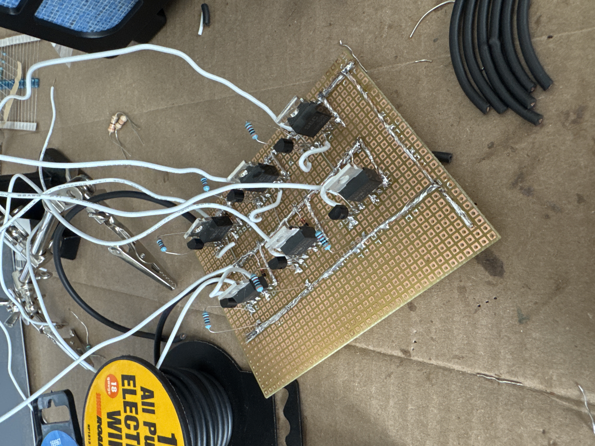

### ESC project

## Goal

The goal of this project is to demonstrate my understanding of embedded systems through building an ESC for BLDCs. 

The custom PCB is being built through KiCAD, but the current controller is made with bought hobby parts.

I have made both Arduino (AVR) and STM32 control code. 

# Images

First attempt: 

  

Second attempt

  

  

